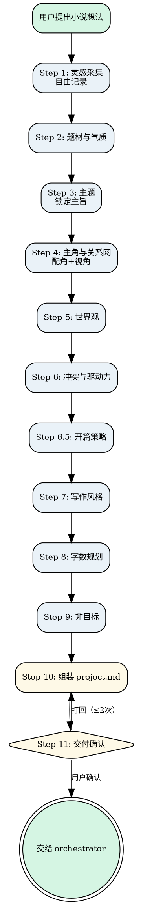

# Novel Brainstorm

把散乱灵感收敛成一个能直接开工的 `project.md` 和 `人物/` 文件夹。不写大纲、不写正文、不造设定集——只做一件事：**把模糊想法压实到足够清晰**。

核心方法论：**渐进收束**。从碎片出发，每轮只聚焦一个维度、只问一个问题，逐步把题材、主题、主角与关系网、世界观、冲突与驱动力、开篇策略、写作风格、字数、非目标九个维度压实，最终组装 `project.md`。

<HARD-GATE>
在 project.md 写好且用户确认之前，不得调用 novel-outline、novel-draft 或任何其他 novel skill。无论想法看起来多清晰，半生不熟的 project.md 会毒害所有下游 skill。

**每一轮对话必须只包含一个问题，附带 2-4 个选项，然后停下来等待用户回答。** 不要在一轮中问多个问题。不要把多个维度合并成一个问题。不要说"让我确认一下剩余的问题"然后列出多个问题。一个问题。等待回答。然后下一个问题。
</HARD-GATE>

## 反模式："这个想法够清楚了，可以跳过 brainstorm"

每个小说项目都必须经过这个流程。即使有人说"我已经完全清楚要写什么"，你仍然需要提取并确认核心 premise、角色、世界规则、冲突和写作约束，产出 project.md。如果想法已经成型，brainstorm 可以很快（3-4 轮问题即可），但必须产出完整的 project.md 并得到用户确认后才能继续。

---

## 检查清单

你必须按顺序完成以下项目：

1. **灵感采集** — 记录用户说的所有内容，不做评判
2. **题材与气质** — 锁定故事类型和氛围（附带选项）
3. **主题** — 锁定故事最终想探讨什么（附带选项）
4. **主角与关系网** — 锁定主角是谁、关键配角、叙事视角、名字（附带选项）
5. **世界观** — 锁定世界类型和核心规则（附带选项）
6. **冲突与驱动力** — 锁定核心张力、升级逻辑和长篇驱动机制（附带选项）
7. **开篇策略** — 锁定故事如何开始（附带选项）
8. **写作风格** — 锁定文字风格（附带选项）
9. **字数规划** — 锁定全书字数和每章目标（附带选项）
10. **非目标** — 锁定不写什么（附带选项）
11. **组装 project.md** — 填写每个字段，每个字段追溯到用户确认内容
12. **交付确认** — 展示 project.md，获得用户确认，交给 orchestrator

---

## 流程图



**终态是调用 novel-orchestrator。** 不要调用 novel-outline、novel-draft 或任何其他 novel skill。brainstorm 完成后唯一调用的 skill 是 novel-orchestrator。

---

## 流程

### Step 1: 灵感采集

**目标：** 把用户脑子里所有碎片倒出来，不做评判，只做记录。

- 邀请用户自由描述想法——任何形式都行：一段话、几个关键词、一个画面、一种情绪
- 原样记录，不做收束或总结
- 如果用户提供了参考作品、情绪板等，一并记录
- **不要在这个阶段做任何收束或总结**——只记录

**验证点：** 有实质内容被记录。

---

### Step 2: 题材与气质

**目标：** 锁定"这到底是什么类型的故事"。

- 基于碎片，提出**一个**关于题材的问题，**附带 2-4 个选项**
  - 示例："根据你描述的碎片，这个故事偏向哪个方向？"
    - A. 硬科幻（注重科学逻辑和技术细节）
    - B. 软科幻（科幻设定为背景，重在人文探讨）
    - C. 科幻奇幻混合
    - D. 其他（你来描述）
- 追问气质/氛围，**附带选项**
  - 示例："你希望读者读完是什么感觉？"
    - A. 紧张刺激（全程高能）
    - B. 温暖治愈
    - C. 细思极恐
    - D. 史诗壮阔
    - E. 其他
- 如有参考作品，追问"你喜欢那部作品的哪个方面"，给出 2-3 个选项

**验证点：** 题材大类和气质方向已确认。

---

### Step 2.5: 主题

**目标：** 锁定"这个故事最终想探讨什么"。

- 基于已确认的题材，提出**一个**关于主题的问题，**附带 2-4 个选项**
  - 选项应基于题材生成具体主题方向，不要给抽象词（如"人性""爱"），要给具体的主旨表述
  - 示例（悬疑题材）："这个故事最终想探讨什么？"
    - A. 在监控社会中，个人隐私和安全之间的边界在哪里
    - B. 真相的代价——知道得越多，是否越危险
    - C. 信任的脆弱——你以为是盟友的人，可能一直在监视你
    - D. 没想好，先写再看
  - 示例（末世题材）："这个故事最终想探讨什么？"
    - A. 在资源枯竭的末世中，为了生存可以放弃多少人性
    - B. 文明的碎片——当一切崩塌，什么值得重建
    - C. 没想好，先写再看
- 如用户选"没想好"，记录为"待定"，不追问

**验证点：** 主题已确认（或标记为"待定"）。

---

### Step 3: 主角与关系网

**目标：** 锁定"谁在经历这个故事，以及 ta 和哪些人产生纠葛"。

- 提出关于主角的**一个**问题，**附带 2-4 个选项**
  - 示例："主角是什么样的人？"
    - A. 普通人被卷入非凡事件（成长型）
    - B. 身怀绝技但隐藏身份（反转型）
    - C. 天生处于权力/命运中心（宿命型）
    - D. 其他
- 追问核心驱动力，**附带选项**
  - 示例："ta 最想要什么？"
    - A. 证明自己/获得认可
    - B. 保护某个人或某种东西
    - C. 揭开某个真相
    - D. 逃离现状/获得自由
    - E. 其他
- 明确询问主角名字。如用户说"没想好"，给出 2-3 个建议名字供选择
- 询问是否已有配角想法。如没有，建议 1-2 个配角类型
- 追问关键配角，**附带选项**
  - 示例："除了主角，故事里还有哪些关键角色？"
    - A. 对手/敌人——与主角直接对立
    - B. 导师/引路人——帮助主角成长
    - C. 盟友/伙伴——与主角并肩作战
    - D. 恋人/情感对象——与主角有情感线
    - E. 其他
  - 为每个确认的配角创建角色卡，在角色卡中明确"与主角关系"
- 追问叙事视角，**附带选项**
  - 示例："故事由谁的视角来讲述？"
    - A. 主角第一人称（"我"）——读者只能知道主角知道的事
    - B. 第三人称有限（跟随主角）——读者能看到主角的行动和部分想法
    - C. 第三人称多视角——不同章节可以跟随不同角色
    - D. 其他
  - 叙事视角写入 project.md 的「写作风格.叙事视角」字段

**验证点：** 主角画像、驱动力、名字、关键配角、叙事视角已确认。

---

### Step 4: 世界观

**目标：** 锁定"故事发生在什么样的世界里"。

- 提出关于世界观的**一个**问题，**附带 2-4 个选项**
  - 示例："故事发生在什么样的世界？"
    - A. 现实世界，隐藏着不为人知的另一面
    - B. 完全架空的异世界
    - C. 近未来地球，科技带来社会剧变
    - D. 历史架空
    - E. 其他
- 追问核心规则，**附带选项**
  - 示例："这个世界的核心规则是什么？"
    - A. 有明确的力量等级体系
    - B. 力量来自特殊血统或天赋
    - C. 没有超自然力量，核心是社会博弈
    - D. 其他
- 确认世界对主角的关系，**附带选项**

**验证点：** 世界类型、核心规则已确认。

---

### Step 5: 冲突

**目标：** 锁定"故事的核心张力是什么"。

- 提出关于冲突的**一个**问题，**附带 2-4 个选项**
  - 示例："最大的矛盾来自哪里？"
    - A. 人 vs 人（明确对手）
    - B. 人 vs 体制/社会
    - C. 人 vs 自我
    - D. 人 vs 未知/命运
    - E. 其他
- 追问冲突升级逻辑，**附带选项**
  - 示例："矛盾会怎么发展？"
    - A. 逐步升级
    - B. 隐忍积累，最终爆发
    - C. 波折不断，一环扣一环
    - D. 其他
- 确认冲突与主角驱动力的咬合，**附带选项**
- 追问长篇驱动机制，**附带选项**
  - 示例："故事靠什么吸引读者一直读下去？"
    - A. 角色成长弧光——看主角从弱变强、从迷茫到坚定
    - B. 事件链条——悬念和反转，一环扣一环
    - C. 世界观探索——逐步揭示世界的真相
    - D. 人物关系博弈——多方势力的明争暗斗
    - E. 其他

**验证点：** 冲突类型、升级方向、长篇驱动机制已确认。

---

### Step 5.5: 开篇策略

**目标：** 锁定"故事怎么开头"。

- 提出关于开篇的**一个**问题，**附带 2-4 个选项**
  - 示例："你希望故事怎么开头？"
    - A. 从事件中间开始（in media res）——直接进入紧张场景，不铺垫
    - B. 从一个悬念画面开始——先给读者一个疑问，再慢慢展开
    - C. 从日常中的异常开始——平静的日常中突然出现不对劲的细节
    - D. 其他（你来描述）
- 开篇策略写入 project.md 的「核心 Premise」中，追加一行"开篇策略：XXX"

**验证点：** 开篇策略已确认。

---

### Step 6: 写作风格

**目标：** 锁定"文字应该是什么感觉"。

- 提出关于文风的**一个**问题，**附带 2-4 个选项**
  - 示例："你希望文字是什么风格？"
    - A. **冷白描**（余华/海明威式）——克制、短句、情感内敛，适合现实主义/悬疑/战争
    - B. **系统爽文**——快节奏、憋屈反转、升级打脸、系统面板，适合系统流/升级流/都市逆袭/玄幻修仙
    - C. **怪诞悬疑**（《十日终焉》《诡秘之主》式）——规则怪谈、信息不对称、推理反转、认知入侵，适合规则怪谈/无限流/克苏鲁/智斗/生存游戏
    - D. 其他（请描述你想要的风格）
- 如用户选"其他"，追问 1-2 个具体偏好（句式长短？情绪浓度？对话密度？）

**验证点：** 风格已确认，将写入 project.md 的「写作风格」字段。

---

### Step 8: 字数规划

**目标：** 确认"写多长"。

- 提出关于字数的**一个**问题，**附带 2-4 个选项**
  - 示例："全书大概写多长？"
    - A. 15-30 万字
    - B. 50-80 万字
    - C. 80-150 万字
    - D. 150 万字以上
    - E. 其他
- 每章字数默认 2300 字左右（写在 project.md 模板中），如需修改可直接编辑 project.md
- **问完这个问题后，STOP。等待用户回答。不要继续问其他问题。**

**验证点：** 字数规划已确认。

---

### Step 9: 非目标

**目标：** 确认"不打算写什么"。

- 提出关于非目标的**一个**问题，**附带 2-4 个选项（可多选）**
  - 示例："以下哪些内容你不想写？（可多选）"
    - A. 感情线/恋爱戏份
    - B. 详细战斗/动作场面
    - C. 政治权谋博弈
    - D. 大段世界观说明
    - E. 其他
- **问完这个问题后，STOP。等待用户回答。不要继续问其他问题。**

**验证点：** 非目标已确认。

---

### Step 10: 组装 project.md

**目标：** 将所有收束结果组装为 `project.md`。

**project.md 结构（严格遵循 `shared/file-contracts.md` 定义）：**

```markdown
# [书名]

## 核心 Premise
> 一句话：谁 + 在什么处境 + 必须做什么 + 否则会怎样
> 开篇策略：XXX

## 主题
> [一句话主题]

## 角色与关系
> 详细角色信息见 `人物/` 文件夹

- **[主角名字]** → `人物/[主角名字].md`（主角）
- **[配角名字]** → `人物/[配角名字].md`（与主角关系：XX）

## 世界观硬规则
- 规则 1：
- 规则 2：
- 规则 3：

## 核心冲突
- 主线冲突：
- 冲突升级方向：

## 写作风格
- 叙事视角：
- 文风要求：
- 节奏偏好：
- 禁止事项：

## 字数规划
- 全书目标：
- 每章目标：2300 字左右（默认值，用户可修改）

## 变更日志
> 每次 canon 更新时追加
```

- 逐一填写每个字段，每个字段必须能追溯到用户确认内容
- 为每个角色创建 `人物/[角色名].md` 文件，使用 `templates/人物卡.md` 模板
- 向用户展示完整 `project.md` 和角色卡，要求逐字段确认
- 根据反馈修改，直到用户明确确认

**验证点：** 所有字段已填写，用户已确认。

---

### Step 11: 交付确认

**目标：** 确保产出可以无缝交给 orchestrator。

- 确认 `project.md` 和 `人物/` 文件夹已保存
- 向用户展示摘要，询问：
  > "项目设定已完成。请审阅以上内容，确认是否可以继续。"
- 用户确认后，调用 `novel-orchestrator` 推进到下一步（预期为 `novel-outline`）
- 用户不通过则修改后重新确认，最多打回 2 次

**验证点：** `project.md` 和 `人物/` 文件夹存在且用户已确认。

---

## 核心原则

- **一次一个问题** — 每轮只问一个问题，绝不抛出多个开放性问题
- **选择题 + "其他"** — 每个问题附带 2-4 个具体选项 + "其他"，选项要具体、有区分度、带简短说明
- **选项是起点，不是牢笼** — 给选项是为了降低回答门槛，不是限制创作方向。用户回答超出选项时，优先采纳
- **可追溯** — project.md 的每个字段和角色卡的每个字段都必须能追溯到用户确认内容，不得 AI 臆造
- **绝不假设"随便"** — 用户说"随便""都行""你看着办"时，必须追问直到获得真实偏好
- **种子级别，非蓝图** — 只收束到"种子"级别（足够清晰但不需要详细），具体情节留给 outline 和 draft

## 反模式清单

| 错误行为 | 正确做法 |
|----------|----------|
| 一次抛出 2-3 个问题让用户回答 | 每轮只问一个问题，等回答后再问下一个 |
| 把多个维度塞在一个 Step 里（如"字数+非目标"一起问） | 每个维度一个独立 Step，每个 Step 只问一个问题 |
| 说"让我确认一下剩余的问题"然后列出多个问题 | 永远不要说"剩余的问题"，一次只问一个 |
| 用户说"随便"就自行选择题材/风格 | 追问具体场景或提供选项让用户二选一 |
| 听完描述直接写 project.md | 先完成所有维度的收束，再组装 project.md |
| 在 brainstorm 阶段设计具体情节或章节 | 只收束到"种子"级别（主题/关系/冲突/开篇策略），具体情节留给 outline |
| 跳过"非目标"字段 | 非目标是防止范围蔓延的关键护栏 |
| 给出的选项太抽象（如"热血""温馨"） | 选项要具体、有区分度、带简短说明 |
| 用户回答超出选项时强行归类 | 优先采纳用户的独特方向 |

## 交叉引用

### 上游

- **`novel-orchestrator`**：判定当前处于 `idea` 状态时激活本 skill。

### 下游

- **`novel-outline`**：本 skill 的唯一下游。`project.md` 和 `人物/` 文件夹是 outline 的输入。

### 参考文档

- **`shared/file-contracts.md`**：project.md 和人物卡的字段规范定义（唯一真相源），包括"主题"和"角色与关系"字段
- **`shared/state-rules.md`**：状态流转规则
