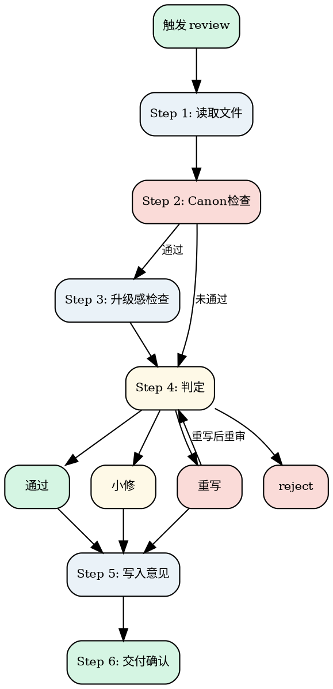

# Novel Review

审查当前章节，决定通过/小修/重写/reject。

**核心原则：只审 guide.md 自检覆盖不到的问题，不做重复劳动。**

guide.md 的"读者视角重读"已经覆盖了：结尾质量、句式重复、伪文学腔、节奏拖沓、情绪平坦、无记忆点。review 不再重复检查这些。

review 只负责 guide.md **无法覆盖**的三件事：
1. **Canon 一致性**——draft 是否引入了未记录的新设定、是否与已有设定冲突
2. **升级感**——和前几章相比，冲突有没有升级、有没有揭示新信息
3. **用户确认闸门**——确保用户看过每章产出，错误不会无声扩散

<HARD-GATE>
Do NOT review without reading: 章节/chapter-xxx.md（目标）+ 正文 + project.md（风格）+ outline.md（任务）。
</HARD-GATE>

---

## Checklist

1. **Read files** — chapter file + prose + project.md + outline.md
2. **Canon check** — new settings? conflicts with existing canon?
3. **Escalation check** — conflict escalation vs previous chapters? new info revealed?
4. **Verdict** — pass / minor-fix / rewrite / reject
5. **Write feedback** — write to chapter file, present to user
6. **Delivery** — invoke novel-update after user confirmation

---

## Process Flow



**Terminal state: invoke novel-update → novel-orchestrator.** Do NOT invoke novel-draft directly for the next chapter.

---

## The Process

### Step 1: 读取文件

读取 `章节/chapter-xxx.md`（目标）+ 正文 + `project.md`（风格）+ `人物/` 角色卡 + `outline.md`（任务）。

---

### Step 2: Canon 检查

**目标：** 确保 draft 没有引入未记录的设定，没有与已有设定冲突。

**检查项：**

1. **新增设定：** 是否引入了 project.md 中未记录的重要新设定？
   - 是 → 🔧 小修（必须在 project.md 中追加记录后再通过）

2. **Canon 冲突：** 是否与 project.md 或角色卡中已确认的事实矛盾？
   - 致命冲突（核心规则矛盾） → ⏪ reject
   - 轻微不一致（细节偏差） → 🔧 小修

3. **任务完成度：** 本章是否完成了 outline 中的任务说明？
   - 完全没做 → ⏪ reject
   - 做了一半 → 🔧 小修

4. **禁止事项：** 是否违反 project.md 中的禁止事项？
   - 违反 → ⏪ reject

**判定逻辑：**
- 任一触发 reject → 直接 ⏪ reject，跳过 Step 3
- 任一触发小修 → 直接 🔧 小修，跳过 Step 3
- 全部通过 → 进入 Step 3

---

### Step 3: 升级感检查

**目标：** 确保本章不是"正确但无聊"的流水账，和前几章相比有推进感。

**检查项：**

1. **冲突升级：** 冲突烈度是否比前一章高或至少持平？
   - 连续 3 章降级 → ⏪ reject（outline 规划有问题）

2. **信息揭示：** 本章是否揭示了至少一个新信息（新事实、新线索、新侧面）？
   - 连续 2 章只推进情节不揭示新信息 → 🔧 小修

3. **主角处境：** 主角处境是否比前一章更复杂？
   - 原地踏步 → 🔧 小修

**判定规则：**
- 1 项不通过 → 🔧 小修
- 2 项及以上不通过 → 🔄 rewrite_required

---

### Step 4: 判定

#### 通过

所有检查通过。

#### 小修

整体方向正确，指出最值得改的 **3 处**：
- **问题：** [具体位置]
- **建议：** [修改方向]

小修只改 1 轮，改完直接通过。

#### 重写

核心问题太大，指出核心问题（1-2 个）+ 重写方向。重写后重新审查，最多 1 次。

#### Reject

方向性错误，建议调整 outline 任务说明，回退到 `novel-outline`。

---

### Step 5: 写入意见

在 `章节/chapter-xxx.md` 中更新「修改意见」section：

```markdown
## 修改意见

**review_status:** pass / minor_fix / rewrite_required / reject
**review_severity:** minor / structural

### 判定依据
1. [具体问题]

### 建议修改
1. [具体修改建议]
```

通过时标记 status = done，向用户展示结果，**等待用户确认**。

---

### Step 6: 交付确认

用户确认后：
1. 调用 `novel-update` 执行 canon 同步
2. update 完成后调用 `novel-orchestrator` 推进到下一章

用户提出修改：
- 小修改 → 直接改，不重新 review
- 大修改 → 重新审查

---

## Key Principles

- **只审 guide.md 覆盖不到的** — 结尾质量、句式重复、伪文学腔、节奏、情绪、记忆点由 guide.md 自检负责，review 不重复检查
- **Canon 是底线** — 新设定必须记录，冲突必须消除
- **升级感是质量线** — 不能原地踏步，不能连续降级
- **小修 1 轮，重写 1 次** — 不无限循环
- **用户确认闸门** — 每章通过后必须用户确认，防止错误无声扩散

## Anti-Patterns

| 错误行为 | 正确做法 |
|----------|----------|
| 重复检查 guide.md 已覆盖的内容（结尾、句式、节奏） | 只审 Canon + 升级感 |
| 小修要求改 5 处以上 | 只指出最值得改的 3 处 |
| 小修后要求改第 2 轮 | 小修只改 1 轮 |
| 重写 2 次还不通过还不回退 | 最多 1 次，不行就回退 |

## Cross-references

### 上游
- **`novel-draft`**：草稿完成后触发
- **`novel-orchestrator`**：判定当前章待审时激活

### 下游
- **`novel-draft`**：小修/重写后回到 draft
- **`novel-outline`**：reject 时回到 outline
- **`novel-update`**：通过后执行 canon 同步
- **`novel-orchestrator`**：通过后推进到下一章

### 关键文件

| 文件 | 职责 |
|------|------|
| `章节/chapter-xxx.md` | 输入：目标；输出：修改意见 + 状态 |
| `【书名】/第X卷/chapter-xxx.md` | 输入：正文 |
| `project.md` | 输入：风格 + Canon |
| `outline.md` | 输入：任务说明 |

### 参考文档

- **`shared/file-contracts.md`**：修改意见格式规范
- **`shared/state-rules.md`**：状态流转规则
